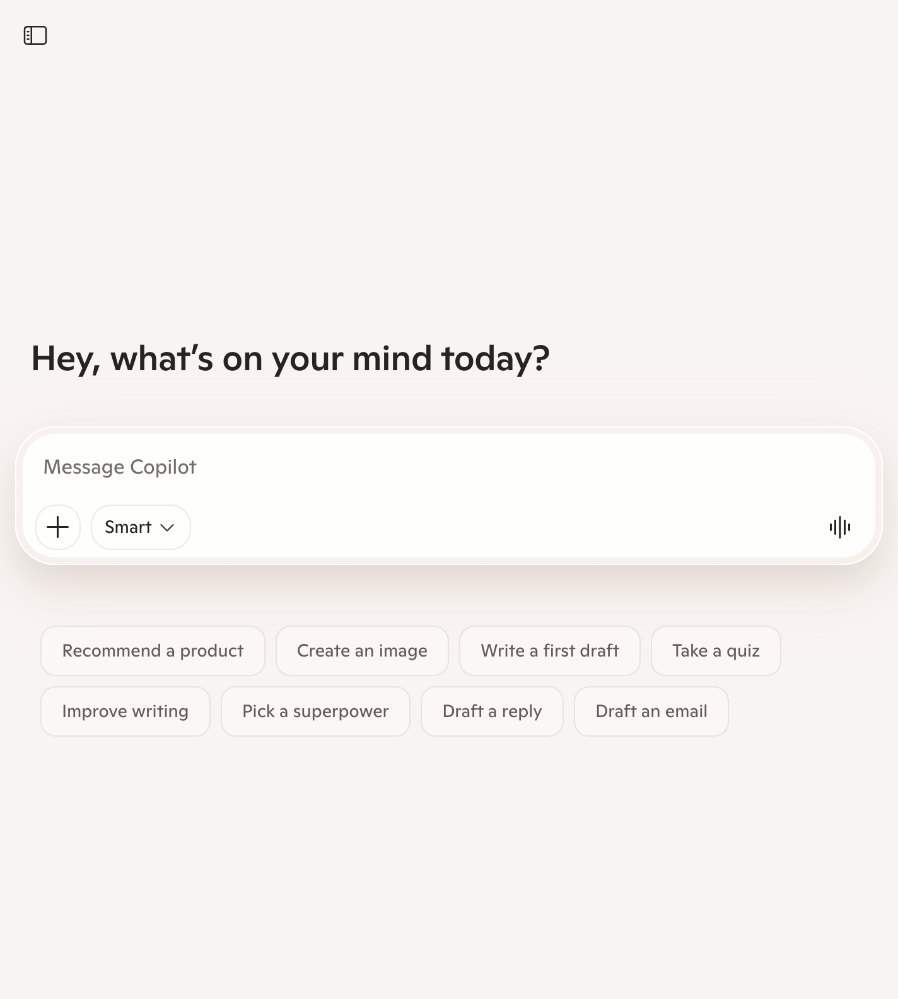
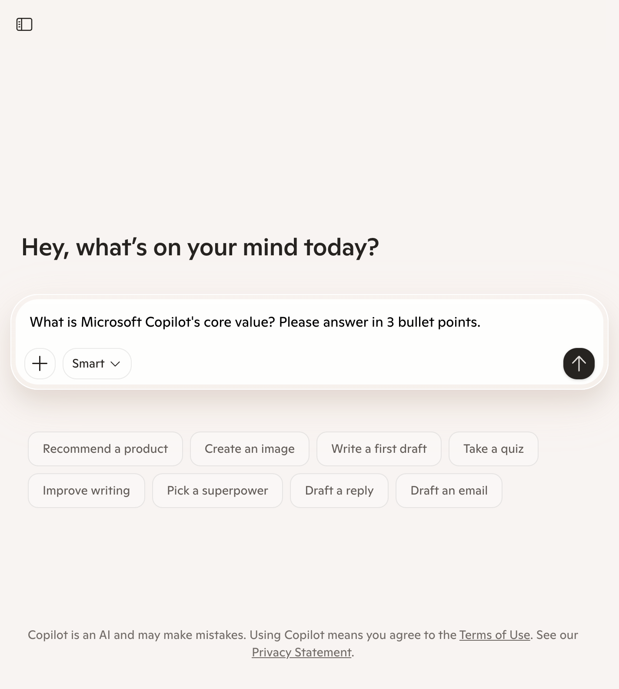
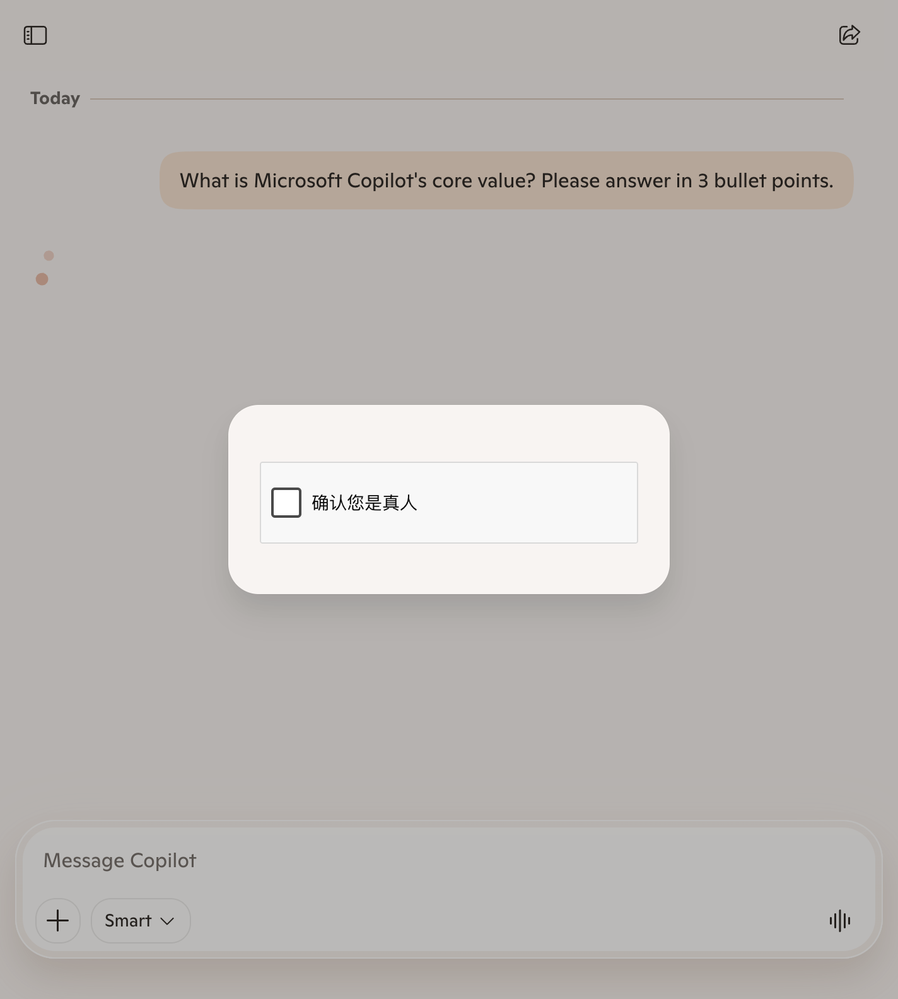
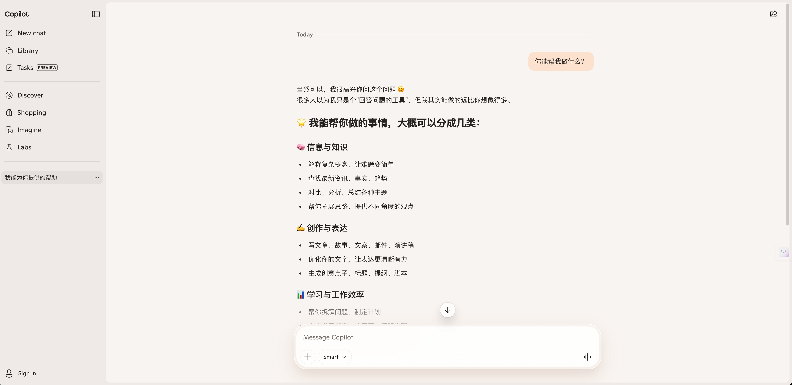

# Microsoft Copilot 产品体验报告（最小化操作）

- 体验时间：2026-03-26
- 体验平台：Web（`https://copilot.microsoft.com/`）
- 体验方式：最小化操作（首页观察 -> 单次提问 -> 结果页观察）
- 体验时长：约 3 分钟

## 一、结论摘要

Microsoft Copilot 的首屏体验清晰，用户可以快速进入提问流程，预置 starter prompts 有助于降低首次使用门槛。  
在本次体验中，核心链路“输入问题并提交”可以完成，但结果输出阶段触发了人机验证弹窗，导致回答内容未直接展示。  
这说明 Copilot 在风控与可用性之间更偏谨慎，真实场景下可能影响“首问即得答案”的连贯体验。

## 二、截图与观察（结合证据）

### 截图 1：首页首屏

- 观察：
  - 首页以大输入框为核心，主任务聚焦明显。
  - 视觉层次简洁，降低新用户认知负担。

### 截图 2：输入前状态

- 观察：
  - 输入区下方提供一组 starter prompts，帮助用户快速起步。
  - 模式入口（Smart）与语音入口可见，具备多入口交互特征。

### 截图 3：输入后待提交状态

- 观察：
  - 输入内容成功写入，提交按钮激活，输入链路可用。
  - 页面继续保留 starter prompts，兼顾引导与自由提问。

### 截图 4：结果页（触发验证）

- 观察：
  - 提交后进入对话页面，但出现“确认您是真人”验证弹窗。
  - 在未完成验证前，回答内容无法显示，主任务被中断。

### 截图 5：结束前状态

- 观察：
  - 验证弹窗持续存在，未自动恢复回答流程。
  - 该状态对“快速得到答案”目标构成明显阻力。
  
## 三、核心体验评估

### 1) 价值传达
- 优点：首屏就传达“可以直接和 Copilot 对话”，路径明确。
- 风险：在回答前插入验证，会削弱“即问即答”的价值感知。

### 2) 任务完成效率
- 优点：输入与提交动作流畅，交互组件响应正常。
- 风险：风控验证打断任务，导致结果获取耗时不可控。

### 3) 可验证性
- 优点：进入聊天页后具备分享、复制等操作位，利于后续内容复用。
- 风险：本次未完成实际答案输出，信息可验证性无法实测（`to verify`）。

### 4) 连续使用动机
- 优点：若无中断，首页模板 + 聊天连续体有潜力形成复访习惯。
- 风险：若频繁触发验证，用户可能在首轮体验中流失。

## 四、问题清单与改进建议

### P0（高优先级）
- 验证弹窗触发时机优化：
  - 尽量避免在“首次回答前”强插验证，降低首轮中断概率。
  - 验证触发后保留问题上下文与清晰恢复提示。

### P1（中优先级）
- 风控体验可解释性增强：
  - 在验证区域增加“为何需要验证”的轻说明，减少困惑。
  - 增加预计耗时与失败后重试指引。

### P2（可迭代）
- 首屏引导优化：
  - 针对不同场景（写作、办公、学习）提供更高价值模板分组。
  - 让 starter prompts 与模式选择形成更清晰映射关系。

## 五、评分（本次轻体验）

- 首轮上手：8.5/10
- 任务链路流畅性（输入/提交）：8.5/10
- 结果可达性：6.5/10（受验证中断影响）
- 交互稳定性：7.5/10
- 综合评分：7.8/10

## 六、后续建议

- 分登录态/未登录态各执行 10 次首问，统计验证触发率与回答到达率。  
- 对比 `Perplexity` 与 `ChatGPT` 的首问成功率、平均到答时间与中断点。  
- 在真实手动环境补充一次“完成验证后的答案质量评估”（`to verify`）。

