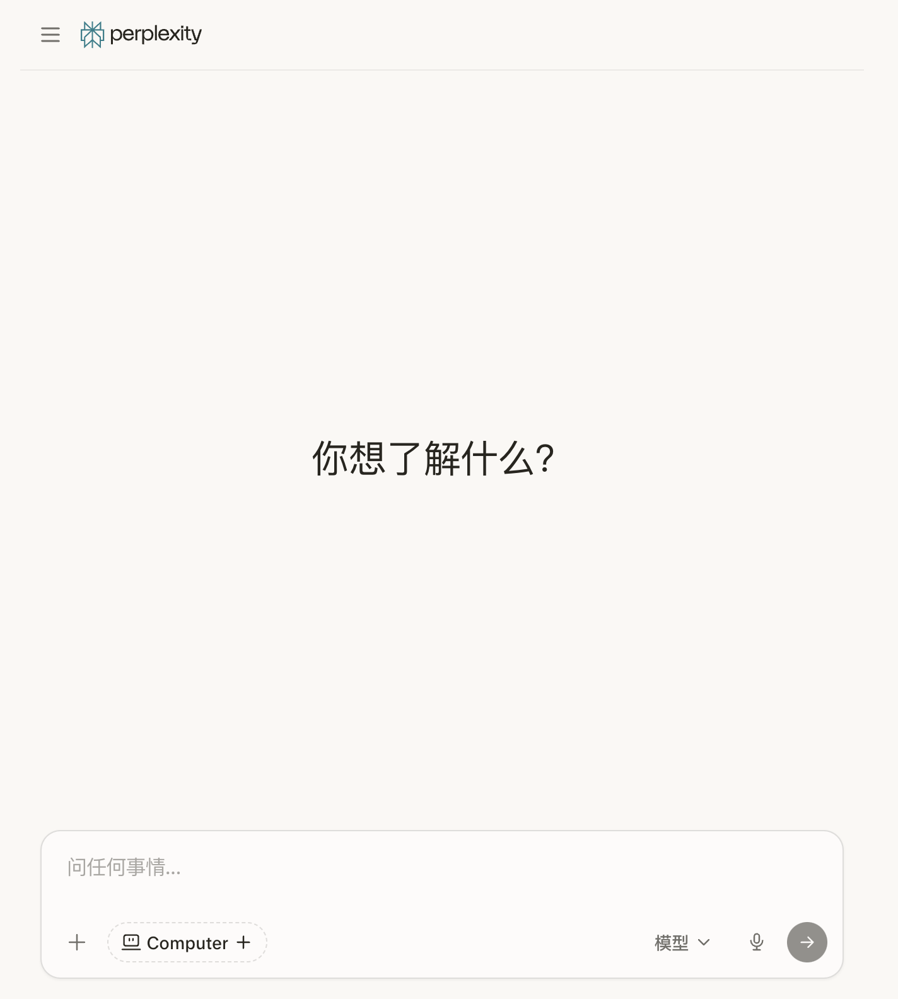
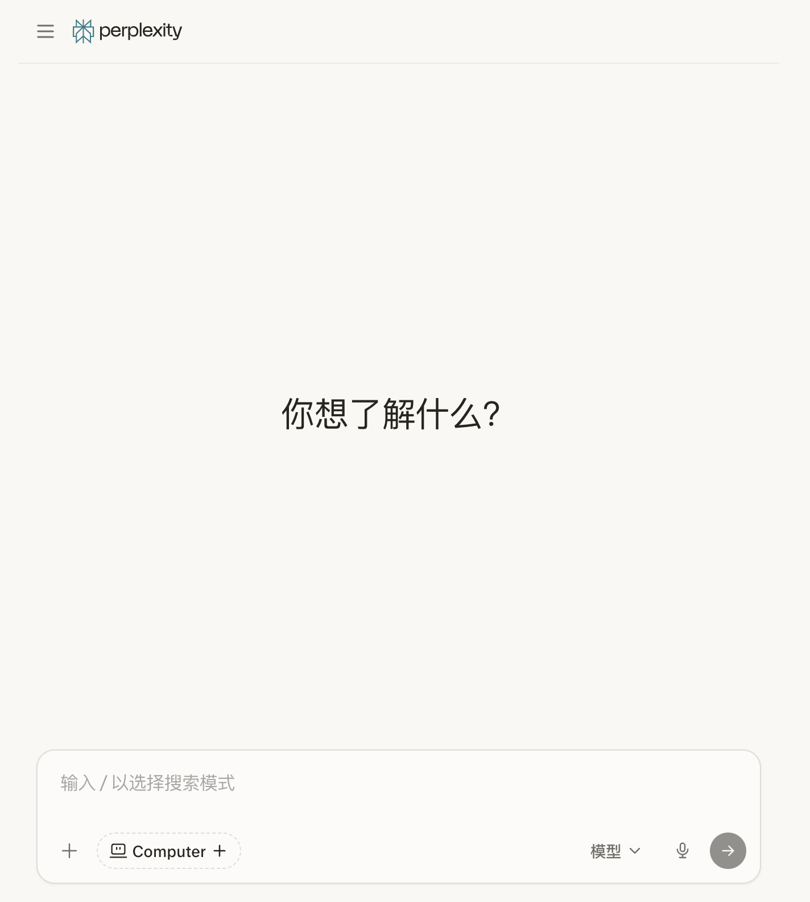
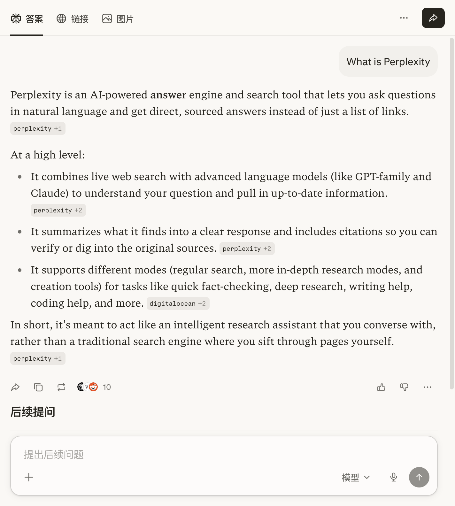

# Perplexity 产品体验报告（基于 5 分钟最小化操作）

- 体验时间：2026-03-26
- 体验平台：Web（`https://www.perplexity.ai`）
- 体验方式：最小化操作（首页进入 -> 单次问答 -> 结果页浏览）
- 体验时长：约 5 分钟
- 官网：https://www.perplexity.ai
- 操作文档：https://docs.perplexity.ai
- 体验入口：https://www.perplexity.ai

## 一、结论摘要

Perplexity 的核心价值是“对话式检索 + 可溯源答案”。在“快速得到可用结论并继续追问”的体验链路上表现优秀，结果页信息组织清晰、后续探索入口明确。  
在本次自动化操作中，输入框出现了“输入未生效/提交按钮禁用”的现象，说明输入链路在特定交互环境下有一定鲁棒性风险。

## 二、截图与观察（结合证据）

### 截图 1：首页首屏

- 观察：
  - 首屏表达直接，主问题输入框突出，用户理解成本低。
  - 页面视觉简洁，减少干扰，聚焦“提问”主任务。

### 截图 2：输入前状态

- 观察：
  - 输入框占位文案清晰，底部工具入口（模型、语音、扩展）可见。
  - 提交按钮随输入状态变化，符合常见问答产品心智。

### 截图 3：输入尝试后状态

- 观察：
  - 自动化输入后页面仍保持类似初始状态，提交按钮未激活。
  - 推测存在输入事件校验或反自动化机制，影响自动流程成功率。

### 截图 4：结果页（完整页面）

- 观察：
  - 回答以结构化段落展示，理解效率高。
  - 回答中存在来源标记（citation），增强可验证性与可信度。
  - 结果页保留继续追问输入区，利于连续研究。

### 截图 5：结果页结束状态

- 观察：
  - 页面在停留后仍保持稳定，关键信息结构未发生异常变化。
  - “答案/链接/图片”分栏和后续问题入口明确，支持多路径探索。

## 三、核心体验评估

### 1) 价值传达
- 优点：首屏直接传达“提问即得答案”的产品承诺。
- 风险：首次用户可能不清楚“模型/模式”差异，探索成本略高。

### 2) 任务完成效率
- 优点：结果页可快速获取结论，不需要手动筛大量链接。
- 风险：输入链路在特殊环境下稳定性不足，会影响首轮转化。

### 3) 可验证性
- 优点：引用来源可见，是区别于纯聊天产品的关键优势。
- 风险：若来源质量波动，用户信任会受影响（本次未深度抽样验证）。

### 4) 连续使用动机
- 优点：后续提问入口明显，天然形成“问题 -> 追问 -> 归纳”的研究循环。
- 风险：若首问失败（输入/提交异常），会直接阻断复访意愿。

## 四、问题清单与改进建议

### P0（高优先级）
- 输入提交链路鲁棒性优化：
  - 强化输入框状态同步，减少“输入后不可提交”的误感知。
  - 提交按钮禁用时给出即时原因提示（例如“请先输入问题”）。

### P1（中优先级）
- 首屏引导增强：
  - 增加高价值示例问题，一键触发，降低首问门槛。
- 模式理解增强：
  - 对“模型/模式”增加轻量说明（适用场景、预期差异）。

### P2（可迭代）
- 结果页动作引导：
  - 强化“继续追问/导出/分享”等任务型入口，提升研究闭环率。

## 五、评分（本次轻体验）

- 首轮上手：8.0/10
- 答案可用性：8.5/10
- 可验证性：8.5/10
- 交互稳定性：7.0/10（自动化场景观察）
- 综合评分：8.0/10

## 六、后续建议

建议下一步做两组补充验证，以提高结论置信度：
- 手动体验（登录态/未登录态）各 10 个问题，统计首问成功率与答案可用性。
- 与 `ChatGPT`、`Claude` 做同题对照，比较“答案结构化程度、可验证性、追问效率”。

