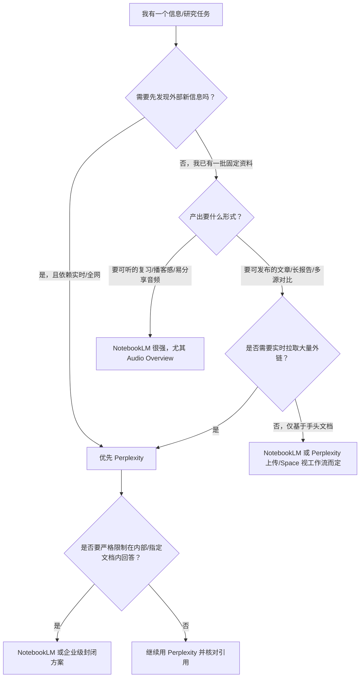

# 搜索与研究 — 品类对比矩阵

**品类定义**：AI 驱动的信息获取与研究工具，从「搜索」到「理解」，核心价值是让用户更快、更准地获得可验证的答案。

**最后更新**：2026-04-03

---

## 一、核心对比矩阵

| 维度 | Perplexity | NotebookLM |
|------|------------|------------|
| **一句话定位** | AI「答案引擎」：实时检索全网 + 大模型综合，用带来源引用的直接回答替代传统搜索的蓝色链接。 | Google 的「来源锚定」研究助手：仅基于用户上传资料回答，把「与自己的知识库对话」做成可信赖的工作流。 |
| **所属公司** | Perplexity AI（独立公司，多轮融资，估值与 ARR 高速增长）。 | Google（DeepMind / Labs 体系内产品，与 Gemini、Workspace、Google One 协同）。 |
| **信息来源** | **开放网络 RAG**：默认从全网实时抓取与索引；可辅以用户上传文件、Spaces 内资料，但心智仍是「向外搜」。 | **封闭文档 RAG**：仅使用用户主动上传/导入的来源（PDF、Docs、网页、YouTube、音频等）；不主动扩展至未授权的外部信息。 |
| **目标用户** | 知识工作者、研究者、学生、创作者、开发者；需要**发现新信息**、跟进行业与学术动态、替代传统搜索栈的用户。 | 研究者、学生、分析师、企业知识工作者；已持有大量资料、需要**消化与交叉理解**而非「从零发现」的用户。 |
| **核心 Job to be Done** | 「帮我在信息海洋里**找到并拼好**当前问题的答案，且我能点进来源核对。」 | 「帮我在**我指定的资料边界内**提炼、对比、答疑，且每一句话都能回到原文。」 |
| **交互模式** | 搜索即对话：提问 → 检索 → 带编号引用的回答 → 追问；Focus（学术/Reddit/金融等）、Deep Research、Pages、Spaces、浏览器 Comet 延伸场景。 | 笔记本为中心：上传资料 → 自动生成摘要/FAQ/学习指南 → 与资料对话（每条回答带段落级引用）→ Audio Overview 等衍生产出。 |
| **可验证性机制** | **引用型可验证**：论点绑定网页/论文等外链来源，用户通过「是否真有此文、是否被曲解」判断可信度；模型仍可能误综合或选偏来源。 | **锚定型可验证**：生成被约束在用户提供的语料内，减少「编造不存在的事实」；用户通过「是否忠实于我的 PDF」判断；若源本身错误或不全，输出上限受限于输入。 |
| **核心差异化** | 把「可验证」做成**实时、开放域**的答案产品，并叠加深度研究、多 Focus、Publisher 生态与独立搜索商业叙事。 | 把「可验证」做成**范围明确、来源封闭**的信任契约，并以 Audio Overview 等**消费级、可传播**的产出形态破圈。 |
| **最强场景** | 即时问答替代搜索引擎、多源快速扫盲、Deep Research 长报告、学术/社区/金融等垂直 Focus、把研究写成可发布的 Pages。 | 文献综述与多 PDF 对比、备考与学习指南、会议/录音资料结构化、**播客式 Audio Overview**（通勤复习、内容素材、病毒传播）。 |
| **最弱环节** | 对上游开放网页质量敏感；复杂对话与长程推理弱于顶级通用助手；企业场景需持续证明合规与 ROI；与广告搜索巨头的长期博弈。 | 无法替代「我不知道该读什么」的发现阶段；非实时、不覆盖全网新闻；重度依赖用户前期整理资料；最终交付往往要导出到其他工具。 |
| **商业模式** | 订阅（Pro 等）+ Publisher Program 分成 + **API** + **企业版**（SSO、合规、不用于训练等），走向独立「AI 搜索」业务。 | 免费层 + **Google One AI Premium** 等捆绑（与 Gemini、Workspace AI 权益打包），服务于 Google 生态留存与付费转化，而非单独拆表财报。 |
| **定价** | **Pro 约 $20/月**（具体以官网为准）；企业/API 按席或用量计价。 | **Google One AI Premium 约 $19.99/月**（区域与套餐略有差异）；免费额度吸引大规模试用，付费与全家桶绑定。 |
| **分发优势** | 品牌即品类心智（「问 Perplexity」）、独立产品迭代快、开发者 API 带来 B 端渗透；浏览器与合作伙伴扩展触点。 | **Google 账户与 Drive/Docs 天然衔接**、低摩擦试用、与 Gemini 品牌联动；海量用户基数与信任背书。 |
| **护城河** | 检索栈、引用体验、Publisher 关系与合规叙事、企业客户与 API 集成深度、先发「答案引擎」品牌。 | 与 Google 基础设施与模型管线的一体化、Workspace 场景渗透、**Audio Overview 等产品级爆款**带来的习惯与口碑；封闭域内的体验难以被简单复制为「又一个上传 PDF 的 App」。 |
| **PM 研究价值** | 研究「AI 如何重构搜索」「订阅制搜索 vs 广告搜索」「开放域下引用如何平衡体验与生态责任」。 | 研究「用产品约束换信任」「窄场景爆款如何带动工具增长」「大厂垂直产品与主品牌如何协同变现」。 |

---

## 二、关键维度深度对比

### 2.1 两种「可验证 AI」路线

二者都在解决「用户凭什么信 AI」，但**信任机制在架构上相反**：

- **Perplexity**：检索**全网**，回答绑定**网页/论文等外部引用** → 可验证逻辑是「你去点开来源，看原文是否支持这句话」——可信性来自**可追溯的外链证据链**，但仍受检索质量、摘要偏差与模型综合错误影响。
- **NotebookLM**：只使用**你上传的文档** → 可验证逻辑是「AI 被关在你的语料里，不能凭空编造库外事实」——可信性来自**来源锚定（Source Grounding）**，幻觉空间被产品设计收窄；代价是**发现新事实**不是主战场。

这是**开放域引用**与**封闭域锚定**的根本分野，不是「谁更先进」，而是**产品承诺不同**：一个承诺「我帮你搜全宇宙并标明出处」，一个承诺「我只说你给我的材料里能支持的话」。

### 2.2 信息来源：全网 vs 封闭文档

| 对比面 | Perplexity | NotebookLM |
|--------|------------|------------|
| 典型 RAG 形态 | 开放网络 RAG + 可选私有/项目资料 | 封闭语料 RAG（笔记本内来源集合） |
| 用户起点 | 常从「一个问题」开始，系统代劳找料 | 常从「一堆文件」开始，系统代劳读透 |
| 适用问题类型 | 「最近 X 行业发生了什么？」「某论文观点是什么？」（需外网） | 「这 20 份合同里风险条款如何分布？」「这几章教材考点是什么？」（料已在手） |

**PM 启示**：品类内可以并存两条主路径——**发现（Discovery）** 与 **理解（Sense-making）**；Perplexity 偏向前者，NotebookLM 偏向后者。同一用户在不同任务上会切换，未必二选一。

### 2.3 产出形态

- **Perplexity**：带内联引用的问答、**Deep Research** 结构化长报告、**Pages**（可发布文章）、**Collections / Spaces** 项目化沉淀；整体偏向「研究 → 可对外输出的文字成果」。
- **NotebookLM**：摘要、FAQ、学习指南、时间线/大纲类结构化笔记、对话回答；**Audio Overview**（双主持人播客式音频）将同一批资料转化为**可听、可分享、易病毒传播**的介质。

**Audio Overview** 是 NotebookLM 的标志性差异化：它把「严肃读文档」变成「消费级内容体验」，既是学习场景延伸，也是**增长与留存杠杆**——这在 B2B 向的工具里并不常见，值得单独拆解其**模板化生成 + 情感化包装**的产品手法。

### 2.4 商业化路径

- **Perplexity**：以 **$20/月量级 Pro** 为核心消费锚点，叠加 **Publisher Program**（缓解与内容方张力）、**API**（开发者与产品嵌入）、**Enterprise**（安全、合规、SSO），叙事是**独立的 AI 搜索公司**，收入结构可多元化。
- **NotebookLM**：**免费层**扩大漏斗，付费与 **Google One AI Premium（约 $19.99/月）** 等捆绑，本质是 **Google 生态的 AI 权益组件**——单产品 ARR 可能永远不单独披露，但对 Workspace 留存、Gemini 付费转化有战略意义。

**PM 启示**：同样标价带，**独立 SKU** vs **捆绑权益** 决定了指标口径（DAU/留存/ARPU vs 生态贡献）与迭代节奏（快试错 vs 与多团队路线图对齐）。

---

## 三、用户选择决策树

**一句话总结**：**先想清楚任务是「向外搜」还是「向内读」**——前者偏 Perplexity，后者偏 NotebookLM；若强依赖音频化传播与学习，NotebookLM 的 Audio Overview 往往是决定性因素。

---

## 四、品类趋势与预判

1. **「可验证 AI」成为主战场**  
   用户从「相信模型口才」转向「要求证据与边界」。引用、锚定、审计轨迹、企业合规将成为标配叙事，差异化会落在**验证成本**（点链 vs 对 PDF）与**错误类型**（综合错 vs 越界编造）的权衡上。

2. **从「搜一下」到「研究工作流」**  
   单品从问答延伸到：多步研究、项目空间、可发布文档、团队权限。Perplexity 的 Spaces/Pages/Deep Research 与 NotebookLM 的笔记本+笔记+多模态导入，都在抢占「研究中间层」，与 Notion、文档套件、浏览器产生重叠与竞合。

3. **音频与多模态产出成为发现与留存杠杆**  
   Audio Overview 证明：**非文本默认格式**可以降低使用门槛、提高分享欲。后续品类可能出现更多「同一知识核、多模态壳」的设计（简报视频、幻灯片旁白、交互式大纲），PM 需在**生成成本、版权与品牌安全**之间找平衡。

---

## 五、PM 启示总结

1. **两种可信模型**：**引用型**（开放域 + 外链）与 **锚定型**（封闭域 + 用户源）解决的是不同失败模式；做产品时要明确主承诺是「帮你找真相」还是「在你给的真相上加工」。

2. **爆款功能可定义增长曲线**：NotebookLM 的 Audio Overview 表明，在工具型品类中，**情感化、可消费的输出形态** 有时比再堆 10% 准确率更能带来传播与留存；关键在是否与服务核心场景（学习、复习、轻分享）同向。

3. **开放 Web 与封闭文档是架构级选择**：影响数据飞轮、版权策略、幻觉责任归属、以及与 Google/Microsoft/Meta 等平台的站位。子产品线往往在一条轴上做到极致，再通过集成或浏览器补另一条轴，而非单应用通吃。

4. **定价相近 ≠ 商业同类**：Perplexity 与 Google One AI Premium 月费量级接近，但前者追求独立软件收入结构，后者追求生态锁定；评估竞品时要看**财报归属、分销渠道与捆绑策略**，避免简单「比价」误判战略。

---

## 六、延伸单品索引（深度稿）

主表仍以 **Perplexity vs NotebookLM** 为「开放域引用 vs 封闭域锚定」主轴；下列单品可按子赛道展开，避免与主表混为一谈。

| 产品 | 子赛道 | 深度稿路径 |
|------|--------|------------|
| Glean | 企业知识搜索 | `产品/搜索与研究/Glean.md` |
| You.com | AI 搜索 + 开发者 API | `产品/搜索与研究/You.com.md` |
| Phind | 开发者向开放网页技术检索（YC 档案曾标 Inactive，存续请核官网） | `产品/搜索与研究/Phind.md` |
| Consensus | 学术文献语义检索与证据汇总 | `产品/搜索与研究/Consensus.md` |

---

*本文档用于品类级 PM 对标，具体功能与价格以各产品官网为准。*
