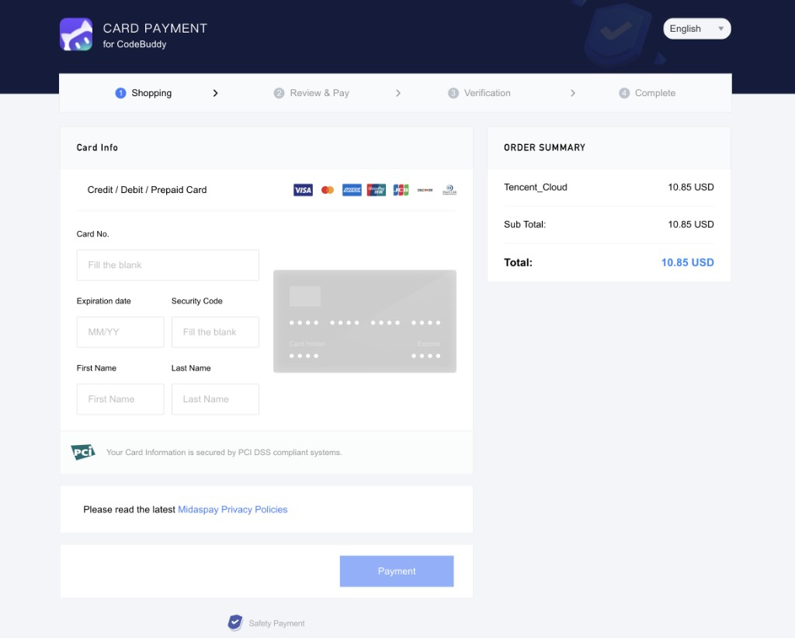

# 腾讯米大师 Midas — 深度研究

**品类**：计费与支付中台 · B2B 商业化基础设施 · **最后更新**：2026-03-31

- 官网：https://midas.qq.com/
- 操作文档：各模块入口（示例）http://wiki.midas.qq.com/post/index/1/36/57（计费）等；资料库汇总 https://midas.qq.com/document
- 体验入口：合作方通过 [midas.qq.com](https://midas.qq.com/) **QQ 登录** 进入应用中心；腾讯内网参见官网说明（midas.woa.com）

---

## 一、摘要

- **一句话定位**：把「收钱、营销、数据、运维、结算、风控」打成模块化产品的一体化 **腾讯系计费商业化平台**，面向游戏与泛互联网等多端收款场景。
- **目标用户**：主研/支付接入工程、运营（活动配置）、财务与结算、风控与运维；腾讯生态合作方及需要出海/多渠道聚合收款的产品团队。
- **核心工作流**：选择端侧形态（Android / IAP / H5 / PC 等）接入 SDK → 沙箱联调 → 审核上线；后台配置渠道与营销活动；用报表与监控优化成功率、实收与稳定性。

---

## 二、为何重要

Midas 代表的是 **平台型商业化中台**：核心成功指标通常是 **支付成功率、时延、实收率、结算周期、资损率**，而不是 DAU。把计费从「项目制开发」升级为「可配置能力」，直接影响收入与人效。

**对 PM 的价值**：可研究如何把 **交易链路** 拆成可售卖的 **标准模块**（渠道、营销、分析、风控、结算），并同时说服技术、运营、财务三类利益相关方；可与 Stripe/Adyen、应用商店 IAP、国内聚合支付等做 **区域与合规维度** 的对比矩阵。

---

## 三、目标用户与场景（含痛点）

### 场景与痛点对照

| 用户场景 | 旧流程痛点 | 产品如何缓解 |
|----------|------------|--------------|
| 多端多地区收款 | 各渠道协议与对接重复，周期长 | 聚合 **180+** 计费相关能力/渠道叙事，统一接入路径 |
| 营销活动上线 | 每次活动依赖研发排期 | 宣称 **11** 类营销方式（满赠、限次、首充、月卡、券、累计等）**低代码/零开发配置** |
| 收入与增长分析 | 支付、运营、画像数据分散 | 转化率、漏斗、计费路径、ARPU、画像等 **计费导向分析** |
| 故障与客诉 | 日志分散，定位慢 | 日志、监控、批量运维工具组合 |
| 对账与分成 | 手工对账、周期长、易出错 | 与财务系统对接，多维度结算、按日分成等叙事 |
| 黑产与套利 | 羊毛党、代充、汇率差套现侵蚀实收 | **500+** 风控策略模型等对外表述 |

---

## 四、核心工作流与交互模型

- **接入导向**：SDK/文档/沙箱/审核闭环，典型 B2B **集成交付** 路径。
- **运营导向**：活动在后台配置，减少对研发的线性依赖。
- **资金与合规导向**：结算、对账、风控与渠道管理是长期留存模块。
- **分析闭环**：从交易数据反哺活动与风控策略（具体能力以对接文档为准）。

公开资料库另提到 SDK 具备 **精准推荐与 A/B 测试** 等能力（见 [资料库](https://midas.qq.com/document)），属于 **增长与变现实验** 向的嵌入式能力，需在商务/技术对接中核实范围与开放度。

### Midaspay 海外卡收银台界面（合作商户示例）

合作方可承载 **Midaspay** 品牌收银台：下图为 **CodeBuddy** 的卡支付页（CARD PAYMENT），流程为四步——Shopping → Review & Pay → Verification → Complete；左侧采集卡号、有效期、安全码与姓名，附 PCI DSS 说明与支持卡组织标识；右侧订单摘要可出现 **Tencent_Cloud** 等行项，页脚链至 Midaspay 隐私政策。可作「对外收银台形态 + 与腾讯系商品/云同链路展示」的直观参考。

---

## 五、关键技术分析（模块级）

以下内容以官网六大板块为准（[midas.qq.com](https://midas.qq.com/)）：

| 模块 | 对外价值主张 |
|------|----------------|
| **计费** | 全球主流渠道覆盖，多端多平台收款 |
| **营销** | 多种活动形态可配置，降低活动交付成本 |
| **数据** | 计费侧指标体系与付费画像 |
| **运维** | 可观测性与批量处理 |
| **结算** | 标准化收入核算与对外分成 |
| **风控** | 反羊毛、反代充、汇率套利等 |

**与「AI 产品」的差异**：官网不以生成式 AI 为主卖点；若存在推荐、风控模型或规则引擎，本质是 **嵌入交易链路的智能化**，叙事仍为金融级计费平台。

---

## 六、首次使用与重复使用

- **首次动机**：需要统一支付/IAP 与商业化后台，减少自建与多系统拼接。
- **复访动机**：持续上新活动、新渠道、新区域；日常对账、监控、风控调优；迁移替换成本极高带来的锁定。
- **留存关键**：渠道稳定性、成功率、结算可信度、合规与资金安全第一。

---

## 七、关键差异化与护城河

- **差异化**：腾讯支付与生态内协同、一体化模块（计费+营销+数据+风控+结算）、面向游戏/泛娱乐场景的成熟路径叙事。
- **护城河**：渠道与资金处理能力、规模化风控与结算经验、商户与交易网络的迁移成本（第三方百科等称大单量与大量商户——**业务数据以官方披露或合同为准**）。
- **风险**：对外开放边界与文档可达性（部分 wiki 链接指向内网域名，外部开发者需以账号权限为准）；与纯国际 SaaS 支付在区域牌照、费率、产品上不可直接等价替换。

---

## 八、商业模式与增长

- **B2B 平台**：按接入、交易量等向商户/合作方收费，条款通常 **合同化**，官网无公开价目表。
- **增长**：依赖腾讯业务生态、出海与合作伙伴拓展；产品侧增长来自 **模块渗透率**（用上营销/数据/风控的客户比例）。

---

## 九、风险、弱点与待验证

- 文档与入口分散（官网 wiki、资料库、可能的内网 wiki）；外部可读性待验证。
- 与海外支付栈组合时的合规、外汇与渠道策略需专项评估。
- 「500+ 策略」等与规模相关的表述需区分 **营销话术** 与 **可审计 SLA**。
- 待验证：国际版、企业版与标准产品在能力边界上的差异（资料库列有「米大师国际版」「米大师企业版」入口）。

---

## 十、B 端 / 支付 PM 启示与核心关注点

- 计费产品是 **多买家决策**：工程关心集成与稳定，运营关心时效与配置自由度，财务关心对账与审计。
- 产品力可体现在：**少代码活动**、**可观测性**、**成功率和实收** 的可量化提升，而非界面炫酷。
- 可对比关注点：Midas（一体化中台）vs 单点最优（仅支付网关、仅风控 SaaS）的采购逻辑与 TCO。

---

## 十一、Product Q&A

| 问题 | 回答 |
|------|------|
| **用户第一次为什么来？** | 要多端、多渠道统一收款与 IAP，并希望活动、数据、风控不要各上一套系统。 |
| **用户第二次为什么回来？** | 持续配置活动与渠道、日常对账监控与风控调优；切换供应商迁移成本极高。 |
| **解决了旧工作流中哪些痛点？** | 多渠道重复对接、活动研发排期、数据分散、黑产套利与对账耗时。 |
| **核心护城河是什么？** | 渠道与资金处理、合规与规模化工程、腾讯体系协同及网络锁定；非物质上的「模型名声」。 |
| **聊天工具 vs 任务完成工具？** | **任务/工作流工具**：接入、配置、查数、对账、告警。 |
| **AI 是主角还是嵌入工作流？** | **非 C 端 AI 产品**；若有推荐/风控模型，为 **链路上嵌入式能力**。 |
| **产出可编辑/可验证/可分享/可复用？** | 强在 **可验证、可审计**（报表、对账、规则效果）；与「文档草稿」类可编辑产出不同。 |
| **变现靠模型能力还是工作流价值？** | **工作流与资金处理价值**（成功率、实收、合规、人效），非按 token 售模。 |

---

## 十二、可比产品（粗粒度）

| 路线 | 关系 |
|------|------|
| 支付宝/微信开放能力、易宝等国内聚合 | 部分模块重叠；Midas 偏 **腾讯一体化计费中台** 叙事 |
| Stripe、Adyen、应用商店 IAP、dLocal 等 | 区域与合规不同，常见 **组合使用** 而非简单替代 |

---

*最后更新：2026-03-31*
