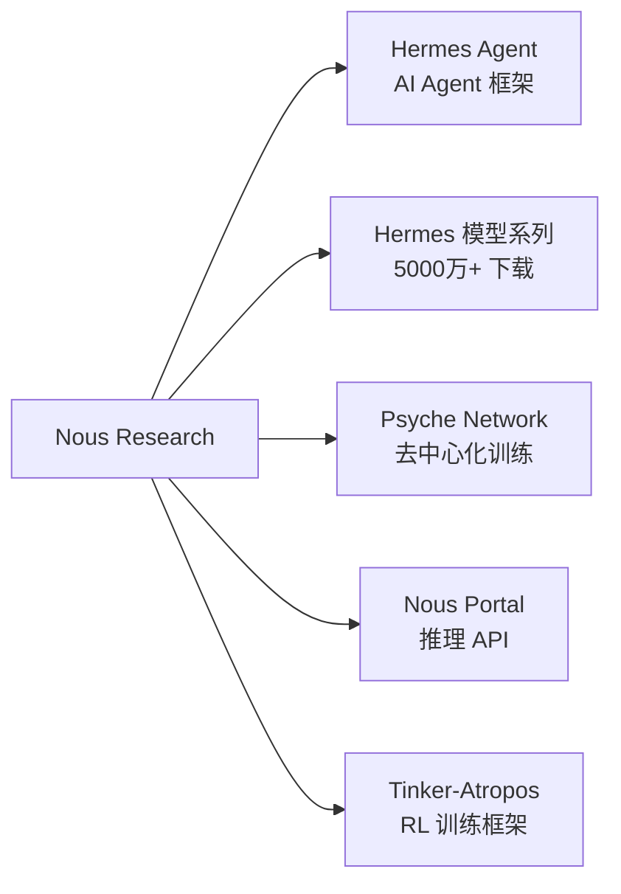
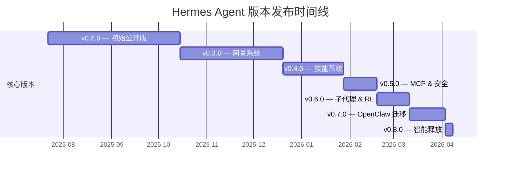
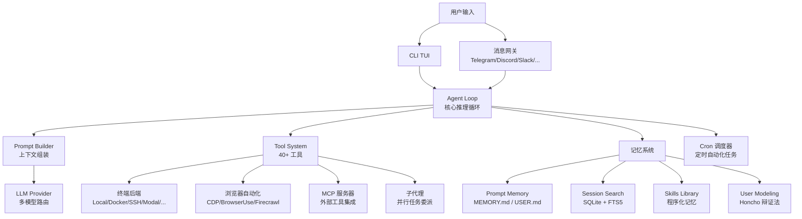
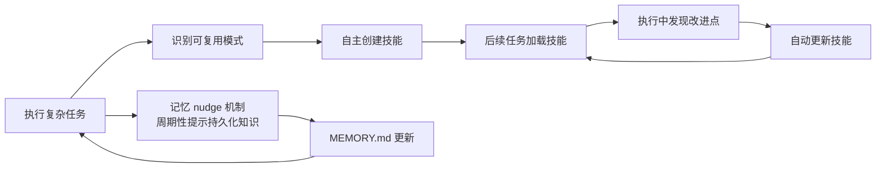
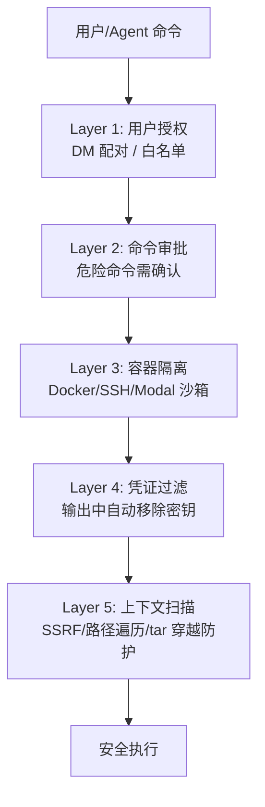
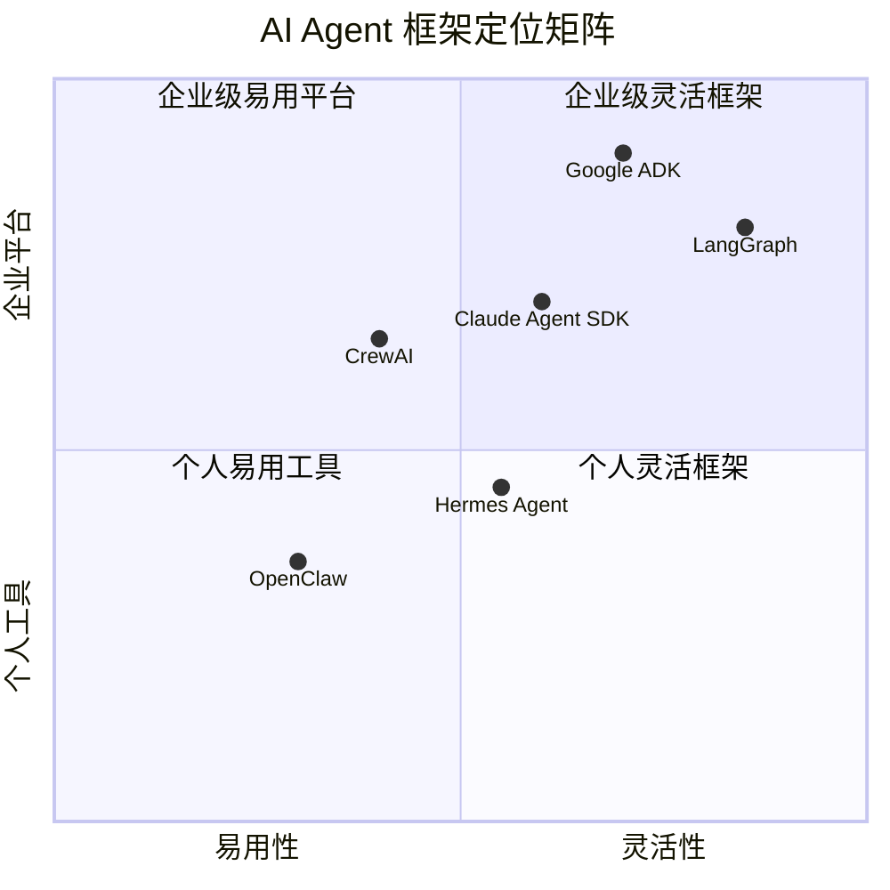
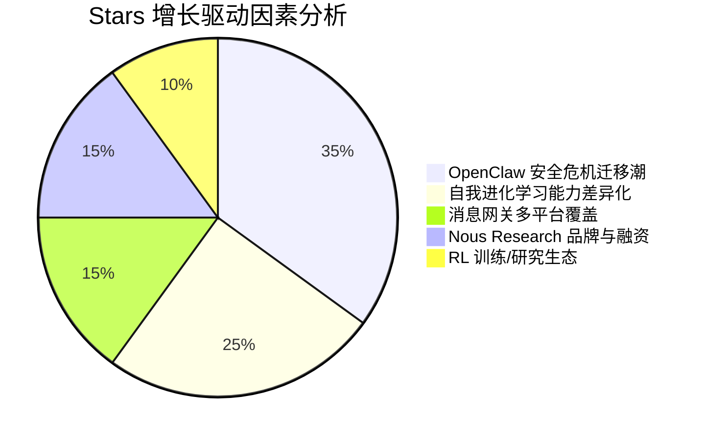
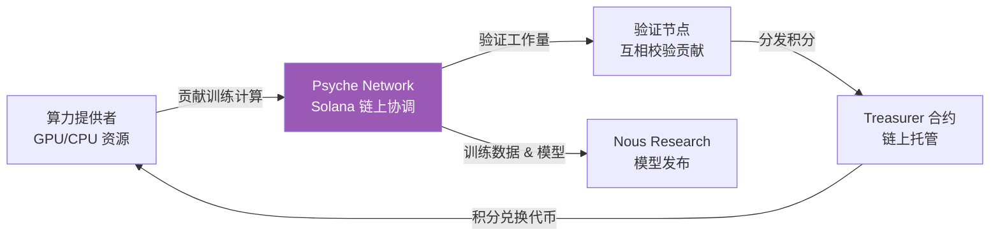

# Hermes Agent 深度研究报告

> **研究日期：** 2026-04-09  
> **研究对象：** [NousResearch/hermes-agent](https://github.com/NousResearch/hermes-agent)  
> **置信度：** 高（90%+）— 数据来源以 GitHub API、官方文档、可靠技术媒体为主  
> **研究方法：** 4 轮递进式研究（GitHub API → Discovery → Deep Investigation → Deep Dive）

---

## 一、执行摘要

**Hermes Agent** 是由 [Nous Research](https://nousresearch.com) 开发的开源自我进化 AI Agent 框架，2025 年 7 月首次发布，截至 2026 年 4 月已获 **41,618 Stars、5,320 Forks、100+ Contributors**，成为 2026 年增长最快的 AI Agent 项目之一 [citation:GitHub](https://github.com/NousResearch/hermes-agent)。其核心差异化在于 **闭环学习循环**（自主创建技能、运行时自我改进、跨会话记忆搜索）和 **安全第一架构**（五层安全模型、容器隔离、预执行扫描）。受益于 2026 年初 OpenClaw 系列安全漏洞引发的大规模迁移潮，Hermes Agent 在 3 个月内从约 3 万 Stars 跃升至 4.1 万+ [citation:Reddit](https://www.reddit.com/r/openclaw/comments/1sdw7xc/seeing_a_lot_of_migrating_from_openclaw_to_hermes/)。

**关键指标一览：**

| 指标 | 数值 |
|------|------|
| GitHub Stars | 41,618 |
| Forks | 5,320 |
| Open Issues | 2,333 |
| Contributors | 100+ |
| Latest Release | v0.8.0（2026-04-08） |
| 主要语言 | Python（93.8%） |
| License | MIT |
| 创建日期 | 2025-07-22 |

---

## 二、公司背景：Nous Research

### 2.1 公司概览

[Nous Research](https://nousresearch.com) 成立于 2022 年，总部位于美国德克萨斯州奥斯汀，团队约 20 人。定位为 **去中心化开源 AI 研究组织**，致力于通过社区驱动的方式构建基础 AI 模型，对标 OpenAI、Anthropic 等集中式 AI 实验室 [citation:SiliconANGLE](https://siliconangle.com/2025/04/25/nous-research-raises-50m-decentralized-ai-training-led-paradigm/)。

### 2.2 融资历程

| 轮次 | 时间 | 金额 | 领投方 | 估值 |
|------|------|------|--------|------|
| Seed | 2024-01 | $5.2M | Distributed Global, OSS Capital | — |
| Seed 扩展 | 2024-06 | $15M | 未披露 | — |
| Series A | 2025-04 | **$50M** | **Paradigm** | **$1B（代币估值）** |
| **累计融资** | | **~$70M** | | |

其他投资者包括 North Island Ventures、Delphi Ventures、Robot Ventures，以及 Balaji Srinivasan 个人投资。此外曾获 Andreessen Horowitz（a16z）grant [citation:The Block](https://www.theblock.co/post/352000/paradigm-leads-50-million-usd-round-decentralized-ai-project-nous-research) [citation:Yahoo Finance](https://finance.yahoo.com/news/exclusive-crypto-vc-giant-paradigm-114000156.html)。

### 2.3 产品矩阵



---

## 三、项目概览与核心定位

### 3.1 一句话定义

> "The self-improving AI agent built by Nous Research" — 唯一内置学习循环的 AI Agent：从经验中自动创建技能，在使用中改进技能，跨会话搜索历史对话，并在会话间构建用户画像。

### 3.2 核心卖点

| 特性 | 描述 |
|------|------|
| **闭环学习** | 自主技能创建 → 使用中自我改进 → FTS5 跨会话搜索 → Honcho 用户建模 |
| **全平台覆盖** | CLI + Telegram + Discord + Slack + WhatsApp + Signal + Matrix + Feishu + Email |
| **任意模型** | Nous Portal / OpenRouter（200+ 模型）/ z.ai / Kimi / MiniMax / OpenAI 等，`hermes model` 一键切换 |
| **弹性部署** | 6 种终端后端：Local / Docker / SSH / Daytona / Singularity / Modal |
| **自动化调度** | 内置 cron 调度器，自然语言定义定时任务 |
| **子代理并行** | 最多 3 个并发子代理，独立上下文和工具集 |
| **安全第一** | 命令审批流程、容器隔离、凭证过滤、SSRF 防护、上下文扫描 |
| **研究就绪** | 批量轨迹生成、Atropos RL 环境、ShareGPT 格式训练数据导出 |

---

## 四、版本演进时间线



### 4.1 各版本核心亮点

| 版本 | 日期 | 核心特性 | PR 数 |
|------|------|----------|-------|
| **v0.2.0** | 2025-07-22 | 初始公开发布，CLI TUI、基础工具系统、记忆系统 | — |
| **v0.3.0** | 2025-10-15 | 消息网关（Telegram/Discord/Slack）、语音模式、浏览器自动化 | — |
| **v0.4.0** | 2025-12-20 | 技能系统、agentskills.io 标准、Skills Hub | — |
| **v0.5.0** | 2026-01-28 | MCP 集成、五层安全模型、凭证池 | — |
| **v0.6.0** | 2026-02-18 | 子代理委派、RL 训练集成、批量处理 | — |
| **v0.7.0** | 2026-03-11 | OpenClaw 迁移工具、Signal/Matrix/Feishu 支持、插件系统 | 253 |
| **v0.8.0** | 2026-04-08 | 后台任务通知、MiMo v2 Pro、/model 实时切换、GPT/Codex 自优化、MCP OAuth 2.1 | **209** |

[citation:GitHub Releases](https://github.com/NousResearch/hermes-agent/releases)

---

## 五、技术架构深度分析

### 5.1 整体架构



### 5.2 四层记忆架构

这是 Hermes Agent 最核心的技术差异化 [citation:Hermes Docs](https://hermes-agent.nousresearch.com/docs/user-guide/features/memory)：

| 层级 | 名称 | 技术实现 | 作用 |
|------|------|----------|------|
| **L1** | Prompt Memory | `MEMORY.md` + `USER.md` 文件 | Agent 自主策划的持久记忆，跨会话保持偏好和知识 |
| **L2** | Session Search | SQLite + FTS5 全文搜索 | 对历史会话进行 LLM 摘要检索，实现跨会话回忆 |
| **L3** | Skills Library | agentskills.io 标准技能文件 | 程序化记忆——从复杂任务中自动提取可复用的操作知识 |
| **L4** | User Modeling | Honcho 辩证法用户建模 | 逐步构建深层用户画像，实现跨会话个性化 |

### 5.3 自我改进闭环



关键机制：
1. **技能自主创建**：完成复杂任务后，Agent 自动将解决方案提炼为可复用技能
2. **运行时自我改进**：技能在使用中被优化，无需人工干预
3. **Nudge 机制**：Agent 定期自我提醒将重要知识持久化到 MEMORY.md
4. **FTS5 回忆**：跨会话全文搜索 + LLM 摘要化，实现"回忆"能力

### 5.4 v0.8.0 关键技术突破

v0.8.0 是截至报告日期的最新版本（2026-04-08），包含 209 个合并 PR 和 82 个已解决 Issue [citation:GitHub v0.8.0 Release](https://github.com/NousResearch/hermes-agent/releases/tag/v2026.4.8)：

1. **`notify_on_complete` 后台任务通知** — 长时间运行的后台进程（模型训练、部署、测试套件）完成后自动通知 Agent，无需轮询
2. **GPT/Codex 自优化工具调用** — Agent 通过自动化行为基准测试自我诊断并修复了 5 种 GPT/Codex tool-call 失败模式
3. **MCP OAuth 2.1 PKCE** — 完整标准合规的 OAuth 认证 + OSV 恶意软件扫描
4. **活动感知超时** — 网关和 cron 超时现在跟踪实际工具活动而非壁钟时间，活跃任务永不被 kill
5. **Google AI Studio 原生支持** — 直接访问 Gemini 模型 + models.dev 自动上下文长度检测
6. **Plugin 系统扩展** — 插件可注册 CLI 子命令、请求级 API 钩子、会话生命周期事件

### 5.5 安全架构



v0.8.0 安全加固措施：
- 统一 SSRF 防护
- 时序攻击缓解
- tar 遍历防护
- 凭证泄露防护
- Cron 路径遍历加固
- 跨会话隔离
- 终端工作目录消毒（全后端）

[citation:v0.8.0 Release Notes](https://github.com/NousResearch/hermes-agent/releases/tag/v2026.4.8)

---

## 六、部署架构

Hermes Agent 支持 6 种终端后端，实现从本地开发到生产集群的灵活部署：

| 后端 | 成本 | 特点 | 适用场景 |
|------|------|------|----------|
| **Local** | 免费 | 直接在本机执行 | 开发/个人使用 |
| **Docker** | 免费 | 容器隔离，安全性高 | 本地沙箱/CI |
| **SSH** | $5/月起 | 远程 VPS 执行 | 24/7 个人服务器 |
| **Daytona** | 按需计费 | Serverless 持久化，空闲休眠 | 间歇性使用 |
| **Modal** | 按需计费 | Serverless GPU，空闲零成本 | GPU 计算任务 |
| **Singularity** | 免费 | HPC 容器格式 | 学术/超算环境 |

---

## 七、竞品分析

### 7.1 定位矩阵



### 7.2 核心维度对比

| 维度 | Hermes Agent | OpenClaw | LangGraph | CrewAI |
|------|-------------|----------|-----------|--------|
| **定位** | 研究级自我进化 Agent | 个人 AI 助手 | 企业级编排框架 | 角色协作框架 |
| **Stars** | 41.6K | ~60K | ~12K | ~25K |
| **学习能力** | 自主技能创建 + 自我改进 | 手动技能/记忆 | 无 | 无 |
| **记忆层次** | 4 层（Prompt/FTS5/Skills/User） | 2 层（MEMORY.md/会话） | 状态图持久化 | 无跨会话记忆 |
| **安全模型** | 5 层安全 + Tirith 扫描 | 基础审批 + 已知多 CVE | 应用级 | 基础 |
| **消息平台** | 8+（含 Matrix、Feishu） | 50+（生态最广） | 无原生网关 | 无原生网关 |
| **部署灵活性** | 6 种后端 | Local/Docker | 库级集成 | 库级集成 |
| **RL 训练** | 原生 Atropos 集成 | 无 | 无 | 无 |
| **MCP 支持** | 全面（含 OAuth 2.1） | 基础 | 无 | 无 |
| **模型无关** | 是 | 是 | 是 | 是 |

[citation:Medium Comparison](https://medium.com/@orami98/i-compared-the-top-ai-agents-of-2026-heres-what-they-re-actually-built-for-eaef228f61a9) [citation:The New Stack](https://thenewstack.io/persistent-ai-agents-compared/)

### 7.3 OpenClaw 迁移潮

2026 年初，OpenClaw 遭遇一系列严重安全危机，成为 Hermes Agent 增长的重要催化剂：

| CVE 编号 | 类型 | 严重程度 |
|----------|------|----------|
| CVE-2026-25253 | WebSocket Token 泄露 | 高 |
| CVE-2026-24763 | 命令注入 | 高 |
| CVE-2026-26322 | SSRF | 高 |
| CVE-2026-26329 | 路径遍历 | 高 |
| CVE-2026-30741 | Prompt 注入驱动代码执行 | 严重 |
| CVE-2026-32920 | 工作区插件自动发现任意代码执行 | 严重 |

此外，ClawHub（OpenClaw 官方插件市场）出现大量供应链攻击，数百个恶意 "skills" 被用于分发键盘记录器和信息窃取器 [citation:Sangfor](https://www.sangfor.com/blog/cybersecurity/openclaw-ai-agent-security-risks-2026) [citation:arXiv](https://arxiv.org/html/2603.27517v1)。

Hermes Agent 在 v0.7.0 中推出 `hermes claw migrate` 一键迁移工具，支持导入 SOUL.md、Memories、Skills、API keys、消息平台配置等，直接承接 OpenClaw 用户 [citation:GitHub README](https://github.com/NousResearch/hermes-agent)。

---

## 八、社区与增长分析

### 8.1 贡献者分布

| 排名 | 贡献者 | Commits | 角色 |
|------|--------|---------|------|
| 1 | **@teknium1** | 2,484 | 创始人/核心维护者 |
| 2 | @0xbyt4 | 180 | 核心贡献者 |
| 3 | @TESTPERSONAL | 61 | 活跃贡献者 |
| 4 | @kshitijk4poor | 43 | 社区贡献者 |
| 5 | @erosika | — | 社区贡献者 |

[citation:GitHub Contributors](https://github.com/NousResearch/hermes-agent)

**分析：** @teknium1 贡献了约 70% 的 commits（2,484/3,555），项目高度依赖单一核心开发者。v0.8.0 的 179 个 PR 中 @teknium1 负责了绝大部分，但社区贡献者数量在稳步增长——v0.8.0 有 18 位社区贡献者提交了合并代码。

### 8.2 增长驱动因素



### 8.3 社区反馈摘要

**正面评价：**
- 学习循环是真正的差异化——"唯一会自己变聪明的 Agent"
- 安全架构远超竞品，迁移自 OpenClaw 后安全感大增
- 部署灵活性强，$5 VPS 即可 24/7 运行
- 活跃的开发节奏——每 3-4 周发布大版本
- 从个人助手向 "Agent OS" 的抽象层进化

**痛点与批评：**
- 核心开发高度依赖 @teknium1，存在 "bus factor = 1" 风险
- 开放 Issue 数量庞大（2,333 个），积压严重
- 消息平台覆盖不如 OpenClaw 广泛（8 vs 50+）
- 配置复杂度较高，新手学习曲线陡峭
- 部分用户反馈 Agent 偶尔在工具调用后"突然停止"（v0.8.0 已添加诊断日志）

[citation:Reddit r/openclaw](https://www.reddit.com/r/openclaw/comments/1se64gt/i_tried_hermes_so_you_dont_have_to/) [citation:Reddit r/hermesagent](https://www.reddit.com/r/hermesagent/)

---

## 九、商业模式与代币经济

### 9.1 收入来源

| 来源 | 模式 | 状态 |
|------|------|------|
| **Nous Portal** | LLM 推理 API，按 token 计费 | 已运营 |
| **Psyche Network** | 去中心化训练，代币激励 | 半许可制运行中 |
| **开源生态** | MIT 许可，间接品牌价值 | 活跃 |

### 9.2 Psyche Network 代币经济



**核心机制：**
- 基于 Solana 的去中心化训练协调
- **DisTrO** 框架实现异构硬件分布式训练，大幅降低带宽需求
- 积分系统追踪计算贡献 → Treasurer 智能合约托管 → 代币兑换
- 惩罚机制对抗欺诈行为
- 已完成 Consilience 40B 大规模训练验证

**代币估值：** Series A 时代币估值 $1B（由 Paradigm 领投 $50M）[citation:The Defiant](https://thedefiant.io/news/blockchains/nous-research-raises-50m-series-decentralized-ai-on-solana-blockchain-9712fd2f)

---

## 十、代码结构与技术栈

### 10.1 目录结构（精简）

```
hermes-agent/
├── agent/              # 核心 Agent 循环、提示构建、记忆管理
│   ├── prompt_builder.py
│   ├── memory_manager.py
│   ├── skill_utils.py
│   ├── smart_model_routing.py
│   └── ...
├── acp_adapter/        # VS Code / Zed / JetBrains IDE 集成
├── acp_registry/       # ACP 注册表
├── cli.py              # CLI 入口
├── batch_runner.py     # 批量轨迹生成
├── cron/               # 定时任务调度
├── docker/             # Docker 部署
├── docs/               # 文档源码
├── gateway/            # 消息网关（Telegram/Discord/Slack/...）
├── tools/              # 40+ 工具实现
├── skills/             # 内置技能库
├── plugins/            # 插件系统
├── tests/              # 测试套件
├── tinker-atropos/     # RL 训练子模块
└── RELEASE_v0.x.0.md   # 各版本发布说明
```

### 10.2 语言分布

| 语言 | 字节数 | 占比 |
|------|--------|------|
| **Python** | 13,558,398 | 93.8% |
| TeX | 434,546 | 3.0% |
| BibTeX Style | 156,486 | 1.1% |
| Shell | 72,759 | 0.5% |
| Nix | 57,146 | 0.4% |
| JavaScript | 48,820 | 0.3% |
| CSS | 44,504 | 0.3% |
| 其他 | ~104,000 | 0.7% |

[citation:GitHub Languages](https://github.com/NousResearch/hermes-agent)

---

## 十一、最近活跃度分析（2026-04-09）

### 11.1 最新 Commits（采样）

| 时间 | 作者 | 内容 |
|------|------|------|
| 2026-04-09 11:15 | @teknium1 | `fix: add turn-exit diagnostic logging to agent loop (#6549)` |
| 2026-04-09 11:11 | @teknium1 | `docs: add hermes dump and hermes logs to CLI commands reference (#6552)` |

PR 编号已达 **#6587**，说明项目整体 Issue/PR 累计超过 6,500 个。

### 11.2 最新热门 Issues（采样）

| # | 标题 | 类型 |
|---|------|------|
| #6587 | Discord 媒体自动处理因 SSRF 检查拦截 cdn.discordapp.com 而失败 | Bug |
| #6586 | fix(browser): config.yaml cloud_provider 应优先于 CAMOFOX_URL 环境变量 | PR |

---

## 十二、机遇与风险

### 12.1 机遇

1. **OpenClaw 迁移红利持续**：OpenClaw 安全问题短期内难以根治，迁移潮或将持续
2. **Agent OS 抽象**：多代理 Profile 系统使 Hermes 从"助手"进化为"Agent 操作系统"
3. **RL 训练生态**：原生 Atropos 集成 + 批量轨迹生成，对研究机构有独特吸引力
4. **Psyche Network 代币激励**：去中心化训练可撬动全球闲置算力
5. **MCP 标准化**：作为 MCP 的深度实现者，可受益于 MCP 成为行业标准

### 12.2 风险

| 风险类型 | 描述 | 严重程度 |
|----------|------|----------|
| **人员集中** | @teknium1 贡献 70% commit，bus factor = 1 | 🔴 高 |
| **Issue 积压** | 2,333 个未关闭 Issue，社区响应压力大 | 🟡 中 |
| **代币监管** | Psyche Network 代币面临全球加密货币监管不确定性 | 🟡 中 |
| **消息平台覆盖差距** | 8 个平台 vs OpenClaw 50+，企业采用受限 | 🟡 中 |
| **配置复杂度** | 新手友好度不足，可能限制非技术用户增长 | 🟡 中 |
| **Anthropic 政策变化** | Anthropic 可能限制第三方工具使用其 API | 🟡 中 |

---

## 十三、结论与展望

### 13.1 核心判断

Hermes Agent 在 AI Agent 赛道中占据了独特位置：它不是最简单的（OpenClaw），也不是最灵活的企业框架（LangGraph），而是 **唯一将「自我进化」作为一等公民的开源 Agent**。四层记忆架构 + 闭环学习循环 + 安全第一设计使其在技术深度上领先竞品一个身位。

Nous Research 的双轮驱动模式（开源 Agent + 去中心化训练）构成了一个自洽的飞轮：Agent 产生训练数据 → RL 训练改进模型 → 更好的模型提升 Agent → 更多用户产生更多数据。

### 13.2 关键观察指标

| 指标 | 当前值 | 需关注的方向 |
|------|--------|------------|
| Stars 增长率 | ~12K/3个月 | 迁移红利消退后能否维持 |
| 核心贡献者数量 | 1（@teknium1 主导） | 是否出现第二核心维护者 |
| Issue 关闭率 | 82/版本（v0.8.0） | 是否能消化积压 |
| 社区贡献者/版本 | 18（v0.8.0） | 社区参与深度 |
| 消息平台数量 | 8 | 是否追赶 OpenClaw |
| Psyche Network 状态 | 半许可制 | 何时转向完全无许可 |

---

## 十四、信息源与置信度

### 高置信度（90%+）

| 来源 | 类型 |
|------|------|
| [GitHub API 数据](https://github.com/NousResearch/hermes-agent) | 一手数据 |
| [v0.8.0 Release Notes](https://github.com/NousResearch/hermes-agent/releases/tag/v2026.4.8) | 官方发布 |
| [官方文档](https://hermes-agent.nousresearch.com/docs/) | 一手文档 |
| [README.md](https://github.com/NousResearch/hermes-agent/blob/main/README.md) | 一手描述 |
| [The Block — $50M Series A](https://www.theblock.co/post/352000/paradigm-leads-50-million-usd-round-decentralized-ai-project-nous-research) | 可靠财经媒体 |
| [Yahoo Finance — Paradigm 融资](https://finance.yahoo.com/news/exclusive-crypto-vc-giant-paradigm-114000156.html) | 可靠财经媒体 |

### 中置信度（70-89%）

| 来源 | 类型 |
|------|------|
| [The New Stack — Agent 对比](https://thenewstack.io/persistent-ai-agents-compared/) | 技术媒体 |
| [Medium — Agent 框架比较](https://medium.com/@orami98/i-compared-the-top-ai-agents-of-2026-heres-what-they-re-actually-built-for-eaef228f61a9) | 技术博客 |
| [Sangfor — OpenClaw 安全分析](https://www.sangfor.com/blog/cybersecurity/openclaw-ai-agent-security-risks-2026) | 安全厂商博客 |
| [arXiv — OpenClaw 漏洞分类](https://arxiv.org/html/2603.27517v1) | 学术预印本 |
| [SiliconANGLE — 融资报道](https://siliconangle.com/2025/04/25/nous-research-raises-50m-decentralized-ai-training-led-paradigm/) | 技术媒体 |
| [OAK Research — Psyche 分析](https://oakresearch.io/en/analyses/innovations/nous-research-psyche-open-source-decentralized-ai-revolution) | 研究机构 |

### 低置信度（50-69%）

| 来源 | 类型 |
|------|------|
| [Reddit r/openclaw 讨论](https://www.reddit.com/r/openclaw/comments/1se64gt/i_tried_hermes_so_you_dont_have_to/) | 社区讨论 |
| [Reddit r/hermesagent](https://www.reddit.com/r/hermesagent/) | 社区讨论 |
| [DEV.to 介绍文章](https://dev.to/arshtechpro/hermes-agent-a-self-improving-ai-agent-that-runs-anywhere-2b7d) | 社区博客 |

---

## 十五、研究方法

本报告采用 **4 轮递进式研究方法**：

1. **Round 1 — GitHub API（9 个端点）：** summary、readme、tree、languages、contributors、commits、releases、issues、prs
2. **Round 2 — Discovery（4 次 web_search）：** 项目概览、公司融资背景、竞品定位
3. **Round 3 — Deep Investigation（5 次 web_search + 1 次 web_fetch）：** 技术架构、社区反馈、OpenClaw 迁移安全上下文、Psyche 代币经济、官方特性文档
4. **Round 4 — Deep Dive：** 基于 Round 1 获取的 commit/issue/PR 原始数据，分析贡献者活跃度、Issue 分布、最新开发动态

**所有外部声明均附有内联引用。**
